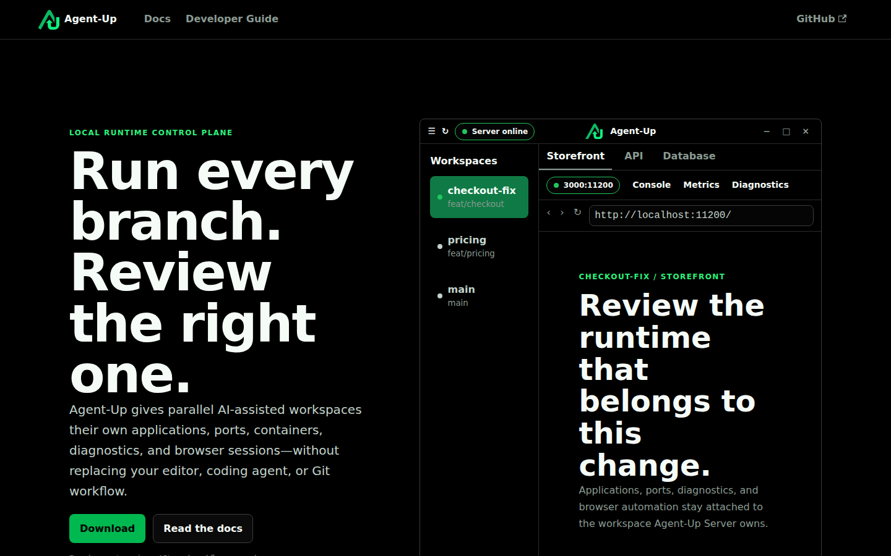

<p align="center" style="margin-bottom: 0; padding: 0">
  <a href="https://github.com/agent-up-oss/agent-up/">
    
  </a>
</p>
<h1 align="center" style="margin-top: 0; padding: 0">Agent-Up</h1>
<p align="center">
  <a href="https://github.com/themassiveone/agent-up/actions/workflows/ci.yml">
    
  </a>
</p>
<p align="center">
  <a href="https://github.com/agent-up-oss/agent-up/">
    
  </a>
</p>

Agent-Up is a local runtime control plane for parallel AI-assisted software development.

It manages the running development environment around applications: workspaces, Git worktrees, application processes, port allocation, Docker services, isolated browser profiles, logs, diagnostics, event history, and automation surfaces.

Agent-Up is not an IDE, application framework, deployment platform, Docker replacement, Git replacement, or production orchestrator.

> **Development Preview:** Agent-Up is under active development. CI produces preliminary platform artifacts, and installer behavior is still being hardened. APIs, configuration, and workflows may change without notice.

## Why Agent-Up Exists

Parallel coding agents make runtime review harder. Each agent may need to run the same application from a different branch, with its own ports, browser state, infrastructure, logs, and diagnostics. Traditional local development workflows usually assume one developer running one application instance.

Agent-Up is built to make those parallel workspaces reviewable without process, port, infrastructure, authentication, or browser-session collisions.

## What Currently Works

See [User docs](docs/user-docs/index.md) for the product map and [Current Limitations](docs/user-docs/limitations.md) for status labels. Shipped surfaces include Server-owned workspaces, Desktop, Mobile, CLI, Git review, ACP agents, five MCP servers, and development-preview packages.

## Current Limitations

Agent-Up is a development preview: packages exist, but they are not a stable update channel. REST, MCP, and `agent-up.json` contracts may change. Browser isolation, diagnostics, event recording, and validation-flow export are Preview or Experimental as labeled in the limitations page. There is no production support commitment.

## Architecture

`AgentUp.Server` is the single source of truth. Desktop, CLI, MCP clients, and future integrations are clients of the Server: they may display state and request actions, but they must not own runtime state or duplicate orchestration logic.

Contributor architecture details live in the [Developer Guide](docs/developer-guide/index.md), especially [Architecture](docs/developer-guide/architecture.md), [Server](docs/developer-guide/server.md), [Desktop](docs/developer-guide/desktop.md), and [Packaging And Installers](docs/developer-guide/packaging.md).

## Requirements

- .NET SDK 10.0 or a compatible SDK for the current target framework.
- Git.
- Docker and Docker Compose for repositories that declare Docker services.
- Node.js and npm for the documentation site.
- Nix on NixOS or Linux systems that need the provided native desktop dependency shell.

Agent-Up may work on additional platforms, but the current development setup has only been verified on NixOS.

## Running From Source

Source lives at `https://github.com/themassiveone/agent-up`. Development-preview packages are published from `https://github.com/agent-up-oss/agent-up/releases`.

Restore and build:

```bash
dotnet restore agent-up.sln
dotnet build agent-up.sln
```

Start the server:

```bash
dotnet run --project AgentUp.Server
```

The repository launch profile currently uses `http://localhost:5001`. Packaged Server services listen on `http://localhost:5000`.

Start the desktop:

```bash
dotnet run --project AgentUp.Desktop
```

On NixOS, use:

```bash
./run-desktop.sh
```

Register a repository that contains an `agent-up.json`:

```bash
dotnet run --project /path/to/AgentUp.CLI -- start --server http://localhost:5001
```

## Example `agent-up.json`

```json
{
  "name": "My App",
  "applications": [
    {
      "name": "Frontend",
      "command": "npm run dev",
      "path": ".",
      "ports": [
        { "variable": "PORT", "defaultPort": 3000 }
      ]
    }
  ]
}
```

## Documentation

- [User docs](docs/user-docs/index.md)
- [Setup](docs/user-docs/setup.md)
- [Downloads](docs/user-docs/downloads.md)
- [Workspace](docs/user-docs/workspace.md)
- [Configuration](docs/user-docs/configuration.md)
- [Browser](docs/user-docs/browser.md)
- [Git changes](docs/user-docs/git-changes.md)
- [Mobile](docs/user-docs/mobile.md)
- [CLI](docs/user-docs/cli.md)
- [Current limitations](docs/user-docs/limitations.md)
- [Roadmap](docs/user-docs/roadmap.md)
- [Developer guide](docs/developer-guide/index.md)
- [Design system](docs/developer-guide/design-system.md)

## Design And Marketing

`AgentUp.DesignSystem/` is the single source of truth for Agent-Up product UI,
documentation, screenshots, and marketing presentation. Its canonical HTML/CSS
catalog compiles to React Native objects and Avalonia resources and styles
consumed by Mobile and Desktop. The public responsive showcase is linked from the
documentation navbar at `/design-system`; implementation and external-repository
usage are defined in the [design-system developer guide](docs/developer-guide/design-system.md).

Build the docs locally:

```bash
npm --prefix docs install
npm --prefix docs run build
```

## Contributing

Contributions are welcome while the project is in preview, especially focused bug reports, setup fixes, docs corrections, and small implementation improvements.

Read [CONTRIBUTING.md](CONTRIBUTING.md) before opening a pull request.

## License

Source code and documentation are licensed under the [Apache License 2.0](LICENSE).

The Agent-Up name and logo are project branding and are not licensed for use as a separate product identity.
